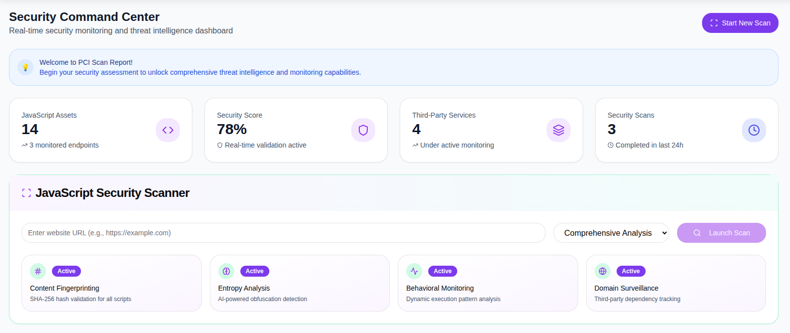
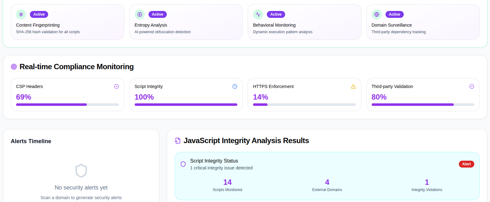

# PCI DSS 11.6.1 – Client-Side Script Integrity Scanner

## Overview
This project is an **educational client-side security prototype** designed to demonstrate how unauthorized JavaScript execution and DOM manipulation risks can be detected in alignment with **PCI DSS 4.0 Requirement 11.6.1**.

The focus is on **security visibility, detection logic, and compliance-aligned reporting**, rather than open-source tooling.

---

## What This Demo Shows
- Detection of unauthorized JavaScript injections
- Identification of third-party scripts executing in sensitive contexts
- Monitoring of DOM manipulation behavior
- Script fingerprinting and integrity validation
- Structured security findings suitable for compliance documentation

---

## Security Capabilities Demonstrated
- **Content Fingerprinting** (hash-based script integrity checks)
- **Entropy Analysis** to flag obfuscated JavaScript
- **Behavioral Monitoring** for DOM manipulation
- **Third-Party Script and Domain Visibility**
- **Real-Time Compliance Scoring**

---

## Screenshots

### Security Command Center
High-level view of monitored JavaScript assets, third-party services, security score, and scan activity.

### Real-Time Compliance Monitoring
Live compliance indicators aligned to PCI DSS 11.6.1, highlighting script integrity, CSP posture, HTTPS enforcement, and third-party validation.

---

## Compliance Alignment

**PCI DSS v4.0**
- **Requirement 11.6.1** – Detection of unauthorized changes to client-side scripts on payment pages

This prototype demonstrates how continuous monitoring and alerting can support compliance evidence and risk detection strategies.

---

## Portfolio Note
Source code is intentionally **not published**.

This repository is used to demonstrate:
- Security detection approaches
- Compliance-focused design thinking
- Reporting concepts used in regulated environments

---

## Author
**Faith Puppala**
